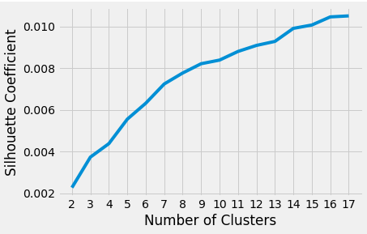

# Using NLP to Visualize Boardgame Data

#### Sources: Boardgame Geek, Kaggle
  
<a href src='https://docs.google.com/presentation/d/1R9CXUHmiZFaTbLBjx4OSr5cFS4R2bOBl8BYCSvYybeg'>Link to Presentation</a>
--- 
## Goals  

### 1. Complete Capstone 2 of the *intense* Galvanize Data Science Immersive bootcamp
### 2. Gain a better understanding of NLP and unsupervised learning including SVD and kMeans clustering
### 3. Look at the model obtained from the unsupervised learning and assign topic titles, compare with game categories scraped from website data (validate the model)
### 4. Get a sense of what other games I should play based on my current preferences
### 5. (Future work) Factor in user-rating, perferred play time, and perferred number of players. Eventually be able to filter

---
<!-- I was one of those people who thought *Monopoly* and *LIFE* when friends mention "boardgame night." But actually, there are *a lot* of boardgames out there. Boardgame Geek alone has over 80k in their database. And they don't even have Monoploy listed as one of them. I have only tried a couple outside of the normall family game night, including Catan, Betrayal, CodeNames.   
How does one pick what else to try? These games aren't cheap. And rightly so: it's a form of art. A good game has meticuluous designed mechanics, intricately illustrated art, and thoughtfully created pieces.  

  Thus is the motivation for the topic of this project. Using what I know I love, I'd like to predict a game I've yet to play but would enjoy. Sure, I can just go to Boardgame Geek to see the recommended games, but the Data Scientist says "where's the fun in that?!" -->
## Data
90,400 rows x 81 columns, where each row is a boardgame

Columns used for NLP: 
* Game Name, 
* Game Description
* Category
* Mechanics
  
Columns used(cleaned) for future work:
* Min / Max Players
* Min / Avg / Max Play Time
* Min Age
* Weight (Complexity of Game)
* User Rating
* #Owned, #Wanted
## EDA

### Words

Text Data:

After some cleaning, (throwing out game without a description, category, or mechanic) I ended up with approximately 82% of the original data.   
> 74,264 board games were used in this analysis.

91 Unique game categories
|                            	|                	|                     	|
|----------------------------	|----------------	|---------------------	|
| Abstract Strategy          	| Exploration    	| Party Game          	|
| Action                     	| Fan Expansion  	| Pike and Shot       	|
| Adult                      	| Fantasy        	| Pirates             	|
| Adventure                  	| Farming        	| Political           	|
| Age of Reason              	| Fighting       	| Post-Napoleonic     	|
| American Civil War         	| Flight         	| Prehistoric         	|
| American Indian Wars       	| Game System    	| Print & Play        	|
| American Revolutionary War 	| Horror         	| Puzzle              	|
| American West              	| Humor          	| Racing              	|
| Ancient                    	| Industry       	| Radio theme         	|
| Animals                    	| Korean War     	| Real-time           	|
| Arabian                    	| Mafia          	| Religious           	|
| Aviation                   	| Manufacturing  	| Renaissance         	|
| Bluffing                   	| Math           	| Science Fiction     	|
| Book                       	| Mature         	| Space Exploration   	|
| Card Game                  	| Maze           	| Spies/Secret Agents 	|
| Children's Game            	| Medical        	| Sports              	|
| City Building              	| Medieval       	| Strip               	|
| Civil War                  	| Memory         	| Territory Building  	|
| Civilization               	| Miniatures     	| Trains              	|
| Collectible Components     	| Modern Warfare 	| Transportation      	|
| Comic Book                 	| Movies         	| Travel              	|
| Deduction                  	| Murder/Mystery 	| Trivia              	|
| Dexterity                  	| Music          	| TV                  	|
| Dice                       	| Mythology      	| Video Game Theme    	|
| Economic                   	| Napoleonic     	| Vietnam War         	|
| Educational                	| Nautical       	| Wargame             	|
| Electronic                 	| Negotiation    	| Word Game           	|
| Environmental              	| Novel-based    	| World War I         	|
| Expansion for Base-game    	| Number         	| World War II        	|

## Steps: 
1. Removed all accents
2. Removed all numbers
3. Tokenized
4. Added Part of Speech tags
5. Lemmatized (extracted meaning)
6. Stemmed (removed prefixes and suffixes)
7. Common words removed during text preprocessing:
    * Game, point, board, player, rule, turn, tile, card, deck, hand, points, victory, win, lose, defeat
8. TF-IDF Vectorization
      > Number of Features: 97,565
  
9.  **Analysis: kMeans clustering on the tokenized words (features) taken only from game descriptions**   

10.  **Compare simliarty between unsupervised learning and categorial words**

### Clusters Generated from Unsupervised Learning

Clusters are pretty accuruate based on categories.

I then created word clouds by filtering each individual category provided by the data, and aggregating all description tokens from games that fell into each respective categories. I then tried to match up my clusters with the actual categoried games' words:

   
However, due to limited computer processing power, I could not expand cluster up to the number of categories. Sihouette Coefficient plot also shows that higher clusters should be used:

## Key Takeaways

Important skills:
* SQL / postgres
* DataFrame 
* list comprehension
* string manipulation
* regex* syntax
* text pre-processing
* de-bugging

More computer memory is needed to fully explore data of this magnitude
Text pre-processing is extremely important in an efficient and accurate analysis (extensive time needed to set up correctly)
K means clustering is the first step unsupervised learning, but to produce pitch-able results, I would need other techniques

### Numbers
Numbers Data:  

Visualization with Scatter Matrix  

 

Some relationship are obvious (user rating vs wishing / wanting), there are colinearity between features that could be factored out.